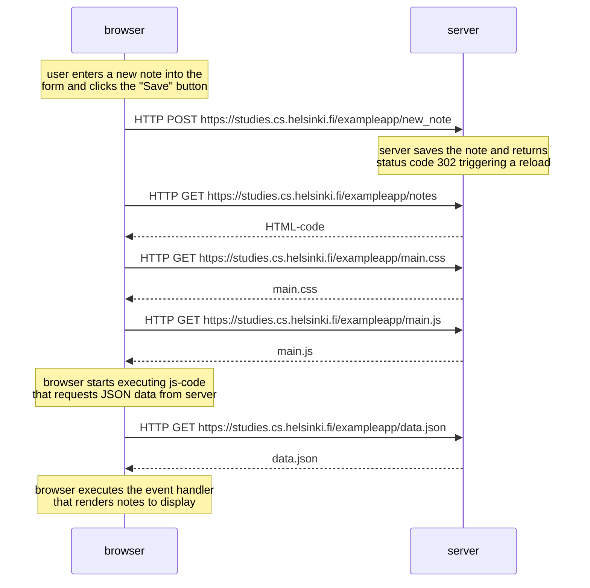

# Exercise 0.4

```
sequenceDiagram
    note over browser: user enters a new note into the<br/>form and clicks the "Save" button
    browser->>server: HTTP POST https://studies.cs.helsinki.fi/exampleapp/new_note
    note over server: server saves the note and returns<br/>status code 302 triggering a reload
    browser->>server: HTTP GET https://studies.cs.helsinki.fi/exampleapp/notes
    server-->>browser: HTML-code
    browser->>server: HTTP GET https://studies.cs.helsinki.fi/exampleapp/main.css
    server-->>browser: main.css
    browser->>server: HTTP GET https://studies.cs.helsinki.fi/exampleapp/main.js
    server-->>browser: main.js
    note over browser: browser starts executing js-code<br/>that requests JSON data from server
    browser->>server: HTTP GET https://studies.cs.helsinki.fi/exampleapp/data.json
    server-->>browser: data.json
    note over browser: browser executes the event handler<br/>that renders notes to display
```


