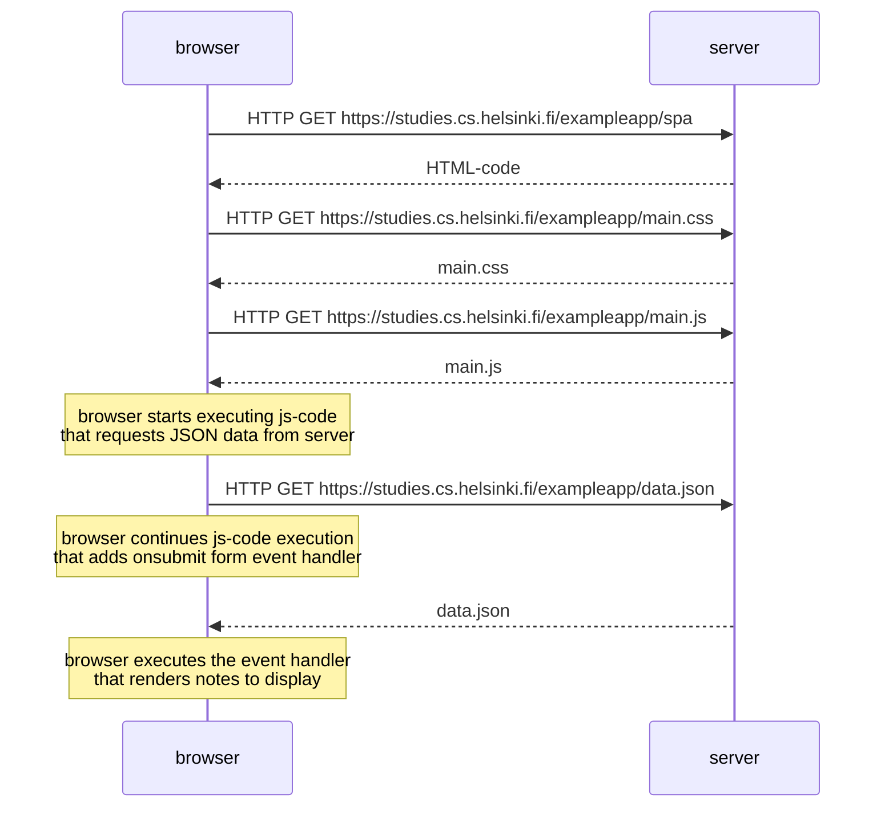

# Exercise 0.5

```
sequenceDiagram
    browser->>server: HTTP GET https://studies.cs.helsinki.fi/exampleapp/spa
    server-->>browser: HTML-code
    browser->>server: HTTP GET https://studies.cs.helsinki.fi/exampleapp/main.css
    server-->>browser: main.css
    browser->>server: HTTP GET https://studies.cs.helsinki.fi/exampleapp/main.js
    server-->>browser: main.js
    note over browser: browser starts executing js-code<br/>that requests JSON data from server 
    browser->>server: HTTP GET https://studies.cs.helsinki.fi/exampleapp/data.json
    note over browser: browser continues js-code execution<br/>that adds onsubmit form event handler
    server-->>browser: data.json
    note over browser: browser executes the event handler<br/>that renders notes to display
```


