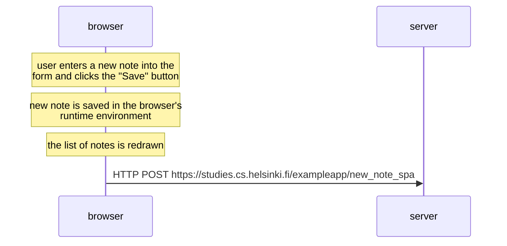

# Exercise 0.6

```
sequenceDiagram
    note over browser: user enters a new note into the<br/>form and clicks the "Save" button
    note over browser: new note is saved in the browser's<br/>runtime environment
    note over browser: the list of notes is redrawn
    browser->>server: HTTP POST https://studies.cs.helsinki.fi/exampleapp/new_note_spa
```


